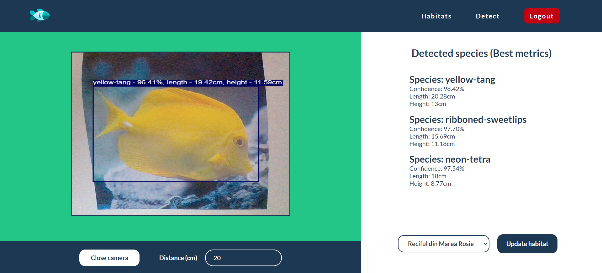

# Fish species detection 
This is a web application designed to detect fish species and estimate their size in real-time using a yolov8 custom trained model.

## Features
- **fish species detection** - only clownfish & blue-tang available now (login required)
- **fish size estimation**

## Credentials
- **email** - user@user
- **password** - user

## Installation

```bash
git clone https://github.com/CosminPascan/fish-species-detection.git
cd client
npm install
```

## Run

In server directory

```bash
dotnet run
```

In client directory

```bash
npm run dev
```

## Detect Page



## Habitats Page

